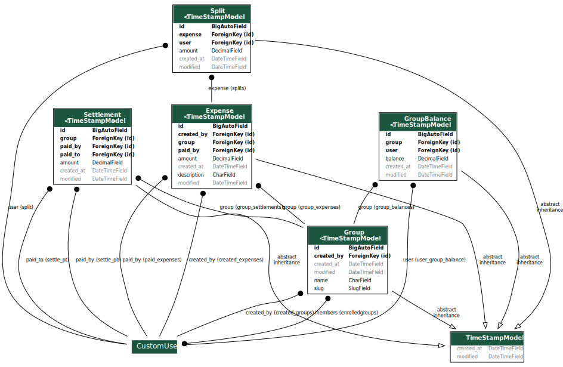
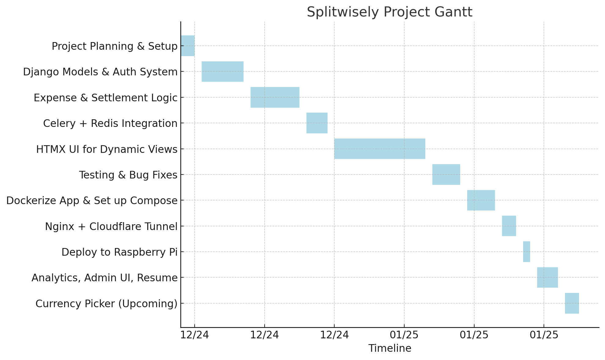

# Split Wisely Project

This project is a clone of the popular expense-splitting application, Splitwise. It's built using Django and HTMX, providing a dynamic and interactive user experience with minimal JavaScript.

## ✅ What’s Inside (Implemented Features)

### 🧾 Expense & Settlement Management

- Create and manage groups
- Add expenses and split them among group members
- View real-time group balances
- Settle debts between members
- Custom split handling via `Split` model

### 🔁 Background Balance Calculation

- Celery task `update_group_balance` triggered on expense/settlement updates
- Efficient aggregation using Django ORM + `defaultdict`
- Handles concurrent updates using `select_for_update`
- `bulk_update` / `bulk_create` for performance
- Auto-cache invalidation with Redis after task completion

### ⚙️ Optimized Django ORM Usage

- `select_related` and `prefetch_related`
- Annotated queries with `Sum` for calculations
- `defaultdict` for clean, performant logic

### 🧠 Smart UI with HTMX

- HTMX-powered partial updates without full page reload
- Used in:
  - Member split previews
  - Settlement form behavior
  - Modal / Off-canvas interactions
- Conditional display of messages (e.g. max payable amount)

### 📦 Redis Caching

- Used to cache group-wise computed balances
- Invalidated via Celery after update

### 🗃 Django Admin Customization

- Admin filters by user/group in Expense and Settlement models
- Enhanced readability and debugging

### 🧪 Query Debugging

- Used `connection.queries` and `reset_queries()` for optimization analysis


## Project Structure
```
split-wisely/
├── splitwisely/           # Django project settings
│   ├── pycache/
│   ├── init.py
│   ├── asgi.py
│   ├── settings.py
│   ├── urls.py
│   └── wsgi.py
├── split/
│   ├─ **pycache**/
│   ├─ migrations/
│   ├─ scripts/
│   │ ├─ **init**.py
│   │ └─ ad_script.py
│   ├─ static/
│   ├─ templates/
│   │ └─ split/
│   ├─ templatetags/
│   │ ├─ **pycache**/
│   │ ├─ **init**.py
│   │ └─ filter_extra.py
│   ├─ **init**.py
│   ├─ admin.py
│   ├─ apps.py
│   ├─ forms.py
│   ├─ helperfun.py
│   ├─ models.py
│   ├─ signals.py
│   ├─ tasks.py
│   ├─ urls.py
│   └─ views.py
├── static/              # Static files (CSS)
│   ├── auth.css
│   └── global.css
├── templates/           # Django templates
│   └── users/           # User-related templates
│       ├── pycache/
│       ├── migrations/
│       └── templates/
│           ├── init.py
│           ├── admin.py
│           ├── apps.py
│           ├── models.py
│           ├── urls.py
│           └── views.py
├── .gitignore
├── db.sqlite3
├── manage.py
└── requirements.txt
```

## Technologies Used

* **Django:** Python web framework.
* **HTMX:** Library for accessing AJAX, CSS Transitions, WebSockets and Server Sent Events directly in HTML, using attributes.
* **Python:** Programming language.
* **HTML/CSS:** Front-end technologies.
* **JavaScript:** For enhanced interactivity.

## Setup

1.  **Clone the repository:**

    ```bash
    git clone git@github.com:RubeshChandar/split-wisely.git
    cd split-wisely
    ```

2.  **Create a virtual environment:**

    ```bash
    python -m venv .venv
    ```

3.  **Activate the virtual environment:**

    * On Windows:

        ```bash
        .venv\Scripts\activate
        ```

    * On macOS and Linux:

        ```bash
        source .venv/bin/activate
        ```

4.  **Install dependencies:**

    ```bash
    pip install -r requirements.txt
    ```

5.  **Apply migrations:**

    ```bash
    python manage.py migrate
    ```

6.  **Create a superuser:**

    ```bash
    python manage.py createsuperuser
    ```

7.  **Run the development server:**

    ```bash
    python manage.py runserver
    ```

8.  **Access the application:**

    * Open your web browser and go to `http://127.0.0.1:8000/`.

## Usage

* Register or log in to the application.
* Create groups and add members.
* Add expenses to groups, specifying the amount and how it should be split.
* View group expenses and balances.

---

## 🧩 Django Model Diagram



---

## 🗓️ Project Timeline – Gantt Chart

The following Gantt chart outlines the complete development journey of Splitwisely, from initial planning to deployment, and includes upcoming features like currency selection.

Each bar represents a continuous phase of work — no idle gaps, just consistent progress 🚀

📌 Legend
* Tasks are aligned chronologically
* Timeline shown in MM/YY format
* Color-coded for visual clarity

### 📊 Gantt Chart



---

## 🔁 Group Balance Recalculation (Celery Task)

This project uses a background task (`update_group_balance`) to **recalculate each user's net balance** in a group based on their expense and settlement history.

### 💡 Balance Formula:

```
net_balance = paid - share + out - in
```

| Term  | Meaning                                   |
| ----- | ----------------------------------------- |
| paid  | Total amount the user contributed         |
| share | Amount the user owes based on splits      |
| out   | Amount settled (paid to others)           |
| in    | Amount received from others as settlement |

---

### 📊 Visual Flow:

```text
       ┌──────────┐       ┌──────────────┐
       │ Expenses │─────▶ │ paid_by user │────────┐
       └──────────┘       └──────────────┘        │
                                                  ▼
                                          ┌─────────────┐
       ┌──────────┐       ┌──────────┐    │  balance    │
       │ Splits   │─────▶ │  user    │───▶│ calculation │
       └──────────┘       └──────────┘    └─────────────┘
                                                 ▲
       ┌─────────────┐     ┌─────────────┐       │
       │ Settlements │────▶│ paid_to/out │───────┘
       └─────────────┘     └─────────────┘
```

---

### ⚙ How It Works:

- Aggregates `Expense`, `Split`, and `Settlement` data efficiently with Django ORM
- Uses `defaultdict` for clean data accumulation
- Applies `bulk_update` and `bulk_create` inside a `transaction.atomic()` block
- Locks rows using `select_for_update()` for consistency
- Invalidates cache for accurate frontend display

---

### 🚀 Outcome:

Each user’s net balance is always accurate and reflects:

- What they paid
- What they owe
- What they’ve paid off (settlements)
- What they’ve received back

Efficient, reliable, and designed for scale.


## JavaScript Functionality

* **`add-expense.js`:**
    * Distributes expense amounts equally among selected users when "Split Equally" is clicked.
    * Makes amount input fields read-only when corresponding checkboxes are unchecked.
    * Handles loading indicators during form submissions using HTMX.

## Contributing

Contributions are welcome! Please feel free to submit a pull request.
